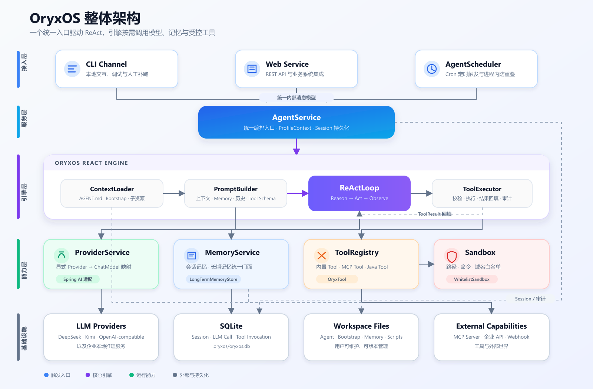

<p align="center">
  
</p>

# OryxOS

> Java 原生、私有可控的 AI Agent OS。

OryxOS 是一个面向企业私有部署场景的开源 Agent 运行底座。它让多个业务 Agent 共享模型接入、ReAct 推理循环、记忆、工具、会话、定时触发、对外 API 和审计能力。

一个自足目录定义一个 Agent，一个 OryxOS 实例运行一群 Agent。业务方只需描述 Agent 的任务并配置它可以使用的模型和工具，不需要为每个 Agent 重复开发一套后端服务。

## 项目状态

> [!IMPORTANT]
> OryxOS 当前处于单机运行时内核开发阶段。9 模块 Maven 工程骨架已经初始化并可编译打包，但核心业务能力仍在开发中。

当前里程碑是完成单机运行时内核。项目暂不适合生产环境使用，也尚未发布稳定版本、容器镜像或稳定 API。

## 为什么需要 OryxOS

企业真正困难的通常不是做出一个 Agent Demo，而是让一群 Agent 在生产环境中可靠、可控地运行：

- 数据必须留在企业自己的基础设施中。
- Agent 需要统一接入不同 LLM，又不能锁定单一厂商。
- 文件、命令、网络和企业系统访问必须受控。
- 对话、模型调用和工具调用需要持久化、可追踪。
- 多个 Agent 不应重复建设渠道、记忆、工具和运维能力。
- Java 企业需要能够复用现有 Spring、JVM 和运维体系的原生底座。

OryxOS 专注于 Agent 运行时和治理底座，不做可视化工作流编排。Dify、Coze 等编排平台可以在 OryxOS 之上调用 Agent；Spring AI、Spring AI Alibaba 等框架则作为 OryxOS 的底层能力被复用。

## 核心能力

### 1. LLM Provider

通过统一 Provider 抽象接入 DeepSeek、通义、Kimi、智谱、OpenAI 兼容服务及本地推理服务。Agent 只引用 Provider 名和模型，不感知具体厂商实现。

多 Provider 并存时，OryxOS 显式维护 provider name 到 `ChatModel` 的映射，避免依赖不可靠的 Bean 类型推断。

### 2. ReAct 循环

OryxOS 自行实现 ReAct 循环：

```text
用户消息
  → 组装上下文
  → 调用 LLM
  → 判断是否调用 Tool
  → 执行 Tool 并回填结果
  → 继续推理或返回最终响应
```

Spring AI 只负责模型协议适配、Function Calling 格式转换和 Tool Schema 生成，不负责自动执行 Tool。推理循环和工具调度始终由 OryxOS 控制。

### 3. Memory

Memory 通过统一接口管理：

- 会话记忆：保存当前 Session 的完整消息历史。
- 长期记忆：跨 Session 保存用户偏好、项目背景和重要事实。
- 情景记忆：记录任务过程和决策，规划在后续阶段实现。

长期记忆后端通过 `LongTermMemoryStore` 解耦，设计支持 Markdown、SQLite 和自托管 Mem0。

### 4. Tool

核心阶段规划提供 9 个内置 Tool：

| 类别 | Tool |
|------|------|
| 文件 | `read_file`、`write_file`、`list_dir` |
| Shell | `shell` |
| HTTP | `http_get`、`http_post` |
| Memory | `save_memory`、`recall_memory` |
| 通知 | `notify` |

业务工具支持三档扩展：

1. 编写 `AGENT.md` 并复用现成 MCP server。
2. 使用任意语言编写 MCP server。
3. 编写 Java `@Tool` Spring Bean。

### 5. Web Service

OryxOS 通过 REST API 暴露会话、Agent 调用、Profile、Memory、Tool 和系统状态。任何能发送 HTTP 请求的系统都可以接入，不受编程语言限制。

## 整体架构



CLI、Web Service 和定时任务只是不同触发入口，最终都进入同一条 `AgentService` 链路，复用相同的 ReAct、Memory、Tool 和审计逻辑。

## 一目录一 Agent

OryxOS 不要求业务方编写 Agent 后端代码，也不使用独立的 Profile YAML。一个目录就是一个业务 Agent：

```text
.oryxos/
├── agents/
│   └── daily-tech-digest/
│       ├── AGENT.md
│       ├── skills/
│       │   └── digest-format.md
│       ├── scripts/
│       └── REFERENCE.md
├── memory/
│   └── MEMORY.md
├── logs/
├── mcp_servers.yaml
├── AGENTS.md
├── SOUL.md
├── USER.md
└── oryxos.db
```

`AGENT.md` 由两部分组成：

- frontmatter：Provider、模型、可用 Tool、MCP、Channel、通知目标、定时规则和循环参数。
- Markdown 正文：Agent 的任务、行为边界以及如何使用子指令或脚本。

OryxOS 从 frontmatter 派生运行时 Profile。`skills/`、`scripts/` 和参考文件不会全部预载，而是由 Agent 在需要时通过底座工具读取或执行。

## 技术栈

| 领域 | 选型 |
|------|------|
| 语言 | Java 21 |
| 应用框架 | Spring Boot 3.x |
| LLM 接入 | Spring AI、Spring AI Alibaba |
| HTTP | Spring MVC + Java Virtual Thread |
| CLI | Picocli |
| 配置解析 | SnakeYAML |
| 持久化 | SQLite + Spring Data JPA |
| Tool 协议 | MCP Java SDK |
| 日志 | SLF4J + Logback |
| 构建 | Maven 多模块 |

工程包含 9 个 Maven 模块：

```text
oryxos-core
oryxos-provider
oryxos-memory
oryxos-tool
oryxos-channel-cli
oryxos-web
oryxos-storage
oryxos-cli
oryxos-boot
```

项目官网位于独立的 `website/` 目录，不属于 Maven 运行时模块，也不会被打包进 Boot JAR。

## 构建与运行

### 环境要求

- JDK 21
- Maven 3.9+

### 编译、测试并打包

```bash
mvn clean package
```

构建成功后，可执行 JAR 位于：

```text
oryxos-boot/target/oryxos-boot-0.1.0-SNAPSHOT.jar
oryxos-cli/target/oryxos-cli-0.1.0-SNAPSHOT-executable.jar
```

### 查看 CLI 版本

```bash
java -jar oryxos-cli/target/oryxos-cli-0.1.0-SNAPSHOT-executable.jar
java -jar oryxos-cli/target/oryxos-cli-0.1.0-SNAPSHOT-executable.jar --version
```

### 启动工程骨架

```bash
java -jar oryxos-boot/target/oryxos-boot-0.1.0-SNAPSHOT.jar
```

默认监听 `8080` 端口。当前工程骨架提供两个系统端点：

```text
GET /api/v1/health
GET /api/v1/info
```

其余 API、CLI 命令和 Agent 运行能力按路线图逐步实现。

## 规划中的使用方式

以下命令描述的是核心版本的目标体验，当前工程骨架尚未实现这些业务命令。

### 初始化工作区

```bash
oryxos init
```

### 创建 Agent

```bash
oryxos profile create weather
```

`profile` 是为了保持 CLI 稳定而保留的命令组名称，实际创建的是 `.oryxos/agents/weather/AGENT.md`。

### 配置模型凭证

```bash
export DEEPSEEK_API_KEY=your-api-key
```

凭证只通过环境变量或安全配置注入，不能明文写入 Agent 定义。

### 与 Agent 对话

```bash
oryxos chat --profile weather
```

### 启动 REST API

```bash
oryxos serve --port 8080
```

OryxOS 中英文项目主页位于独立的 [`website/`](website/) 目录。进入该目录后可使用任意静态文件服务器运行，例如 `python -m http.server 8080`。

完整的目标 CLI 契约见 [CLI 使用文档](docs/CliGuide.md)。

## 核心 API

核心版本规划提供 10 个端点：

```text
POST   /api/v1/sessions
POST   /api/v1/sessions/{id}/messages
GET    /api/v1/sessions/{id}
DELETE /api/v1/sessions/{id}
POST   /api/v1/agents/{name}/invoke
GET    /api/v1/profiles
GET    /api/v1/memory
GET    /api/v1/tools
GET    /api/v1/health
GET    /api/v1/info
```

认证、SSE、WebSocket、RBAC 和限流属于后续阶段。

## 安全模型

安全是 OryxOS 的基础设计，不是上线前再补的功能。

核心阶段包括：

- 文件读写路径白名单。
- Shell 命令与执行超时限制。
- HTTP 域名白名单。
- Profile 级可用 Tool 子集。
- 敏感凭证环境变量注入。
- LLM 和 Tool 调用审计落库。

核心阶段的 `WhitelistSandbox` 是应用层防护，主要防止模型误操作，不能隔离恶意代码。安装带脚本的第三方 Agent 等同于信任其作者。运行不可信代码、多租户和对外服务需要容器或 microVM 级隔离，这些属于后续阶段。

如果发现安全问题，请不要在公开 Issue 中披露利用细节。在项目建立正式安全联络渠道前，请先通过仓库维护者的私密联系方式报告。

## 验收场景

核心版本将通过三个端到端 Demo 验证：

1. **每日天气**：光杆 `AGENT.md`，定时查询天气、生成穿搭建议并通知。
2. **每日科技日报**：`AGENT.md + skills/`，按需读取组稿指令、调用 MCP，并结合用户记忆生成日报。
3. **每日 GitHub 日报**：`AGENT.md + scripts/`，执行确定性脚本获取数据，整理后通知。

三个 Demo 都需要同时支持定时运行和人工补跑，并能通过 API 查询 Session 和调用记录。

## 路线图

### 阶段一：单机运行时内核

- [x] 初始化 9 模块 Maven 工程
- [ ] Provider 抽象与至少两个 LLM 接入
- [ ] 自实现 ReAct 循环
- [ ] 会话记忆与长期记忆
- [ ] 9 个内置 Tool
- [ ] MCP Client
- [ ] CLI、定时任务和核心 REST API
- [ ] SQLite Session 与调用审计
- [ ] 三个端到端 Demo

### 阶段二：企业治理与分布式底座

- [ ] API 认证、SSO、RBAC 和多租户
- [ ] Tool Policy 与完整审计查询
- [ ] 容器和 microVM 沙箱
- [ ] Web 管理台
- [ ] Provider fallback、限流和可观测性
- [ ] 状态外置、多副本和高可用

### 阶段三：跨节点 Agent 协作

- [ ] A2A 协议接入
- [ ] Agent 发现与任务委托
- [ ] 跨节点可靠消息
- [ ] 跨组织协作与治理

## 文档

| 文档 | 内容 |
|------|------|
| [项目概览](docs/oryxos.md) | 产品定位、能力与路线图 |
| [需求文档](docs/DemandAnalysis.md) | 功能需求、数据模型和验收标准 |
| [技术方案](docs/TechnicalSolution.md) | 架构、模块、接口和实施边界 |
| [CLI 使用文档](docs/CliGuide.md) | 目标 CLI 契约和使用方式 |
| [AI 编程指南](docs/AiProgrammingGuide.md) | Spec 驱动的实施顺序 |
| [行业调研](docs/IndustryResearch.md) | Agent OS 格局与 Java 生态定位 |
| [oryx-labs](docs/oryx-labs.md) | 社区愿景 |
| [仓库协作指南](AGENTS.md) | AI 编码助手和贡献者规则 |

建议新贡献者按“项目概览 → 需求文档 → 技术方案 → 仓库协作指南”的顺序阅读。

## 参与贡献

OryxOS 由 [oryx-labs](docs/oryx-labs.md) 社区发起，欢迎参与设计、开发、测试、文档和生态建设。

贡献前请：

1. 阅读 [AGENTS.md](AGENTS.md) 中的架构约束。
2. 确认改动属于当前核心阶段还是后续阶段。
3. 对重大功能先讨论需求和技术方案。
4. 为代码改动补充相应测试。
5. 同步更新受影响的文档。
6. 在 Pull Request 中说明改动范围、验证方式和已知限制。

当前优先欢迎：

- Provider 与 ReAct 核心链路。
- SQLite、MCP Java SDK 和 Spring AI 的可行性验证。
- 测试基础设施和安全边界测试。
- API、部署和贡献者文档。

## 设计原则

- 底座优先于单个 Agent。
- 自实现核心，复用成熟协议适配。
- 一目录一 Agent。
- 对接 MCP、A2A 等开放协议。
- 实例无状态、状态可外置。
- 安全和审计从第一天进入架构。
- 先完成单机最小闭环，再由真实需求驱动分布式演进。

## 许可证

OryxOS 计划采用 Apache License 2.0 发布。正式代码发布前将补充完整的 `LICENSE` 文件。

## 社区

OryxOS 属于 oryx-labs：一个由兴趣驱动、使用 AI coding 探索 AI infra、Agent、AI 应用和 AI 工具的开放社区。

如果你也希望在 Java 生态中建设一个私有、可控、可审计的 Agent 运行底座，欢迎一起参与。
